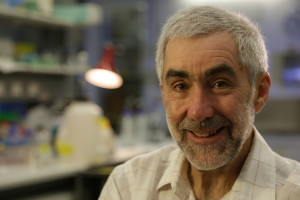

Terry Speed:2013年科学首相奖得主
==================================
*"我太爱统计了，它像把钥匙让我们能溜进任何学科的后院里随便玩耍"*

*—Terry Speed*

图1 Terry Speed

用数字同癌症抗争
----------
[Terry Speed](http://en.wikipedia.org/wiki/Terry_Speed)从不觉得能很快在媒体的头条上看到类似“统计学家治愈癌症”的标题，不过他坚信数学和统计学可以有效地帮助研究者认识癌症背后的诱因，从而减少手术的需要。身兼数学家和统计学家，Terry笔下诞生了不少没有几个人能读懂的精美学术著作，但除此之外，他还有学术成就以外的另一面，他曾出席法庭作证，帮助农户和采钻矿工，和为生物学家提供统计工具以解决基因的进化问题。

20年前，生物学家们只能孤立的研究一两个基因。而今，他们已经能够同时跟踪同一个细胞里的上千个基因，但若想真正理解这些信息，得到他们想要的结果，他们就还需要运用Terry提出的统计方法。

当Terry年近古稀，他专注于挑选正常细胞与癌细胞不同之处，更加接近有效治疗癌症的临床研究，并同业界一同合作研发检测甲状腺细胞增殖是否发生癌变的工具。

因其在解释基因组的解释以及相关技术的研发做出的杰出贡献，这位[WEHI医学研究所](http://en.wikipedia.org/wiki/WEHI)生物信息学领头人荣获2013年[科学首相奖(Prime Minister’s Prizes for Science)](http://en.wikipedia.org/wiki/Prime_Minister%27s_Prizes_for_Science)。

Terry Speed 的采访稿原文
-------------------------
Terry现在供职的WEHI医学研究所在墨尔本市中心，离他以前就读过的高中[University High School](http://en.wikipedia.org/wiki/University_High_School,_Melbourne)和大学[Melbourne University](http://en.wikipedia.org/wiki/Melbourne_University)都不远。虽说他的办公室可以俯瞰他以前读过的高中，也能把那条通往昔日大学的公路尽收眼底，但他一路走来获得如此成就绝不是所见的那么容易。算上在[U.C. Berkeley](http://en.wikipedia.org/wiki/U.C._Berkeley)担任[荣誉退休教授(emeritus professor)](http://en.wikipedia.org/wiki/Emeritus_professor#Retired_faculty)的20年，以及在[Monash University](http://en.wikipedia.org/wiki/Monash_University)，[University of Sheffield](http://en.wikipedia.org/wiki/University_of_Sheffield)，[University of Western Australia](http://en.wikipedia.org/wiki/University_of_Western_Australia)和[CSIRO](http://en.wikipedia.org/wiki/CSIRO)等学校辛勤工作的经历，他一路走来可谓经历了漫长的旅途。

若要说Terry最终从事医药研究的原因，多半可以归结于他早年不幸的回忆——他的肺部曾经因细菌感染患上了支气管扩张。他回忆道：“除了去医院里清肺，冬天我成天都只能呆在家里。”最终他不得不在16岁时做一次肺叶切除的手术。要说这次手术最显著的作用就是他的健康状况有了明显的好转，随后一年他就参加了赛艇比赛，而且从那以后跑步成了他生活必不可少的一项运动。除此之外，这次手术还潜移默化地在他内心深处种下了医学研究的兴趣之种。

1960年，是Terry在University High School的最后一年。就在这一年，附近WEHI医学研究所的免疫学家[Frank Macfarlane Burnet](http://en.wikipedia.org/wiki/Frank_Macfarlane_Burnet)获得了诺贝尔生理学奖。也是在这一年Terry和同校的[Suzanne Cory](http://en.wikipedia.org/wiki/Suzanne_Cory)共享了学校的毕业奖彰的，Suzanne日后成为了WEHI的主管，并最终把Terry也劝到了WEHI。

随后的一年，Terry开始他的医学科学双学位，可仅仅过了一个学期他便意识到纯粹的医学其实并不适合他。他说：“其实我对实验室的工作没有激情，我不想成天盯着显微镜，解剖小白鼠！”因此，他转向专攻数学和统计学的理学学位，但他还保留着自己对医学的兴趣，并同时接手了一个关于突变基因存活模式的荣誉项目(honours project)。 他说：“基因数据及理论推导仿佛与生俱来就特别对数学家的胃口！”

Terry在本科学习行将结束的时候结婚了，几个月后他便在Monash University找到份授课的工作，并半工半读开始攻读数学博士。其后他又四处奔波，先是从Monash到了英国的University of Sheffield，再后来又去往UWA。

Terry在UWA的时候广泛地做对外咨询工作。他经常同一些CSIRO的研究学者紧密合作。他所关注的问题遍及诸如原住民的刑拘比率，Perth的淡水使用到菱形钻石的大小分布等等，涉猎颇广，这也为他赢得了应用统计学家的美誉。最终，他也因自己的成就担任了CSIRO数学和统计学的系主任。

其实Terry的真实想法是要通过实际应用来促进理论的发展。大家通常都认为统计学处于其他学科服务的地位，但他对此一点也不介意。“我倒是很同意这种说法，我觉得统计学本来就应该成就其他学科，我太爱统计了，它像把钥匙让我们能溜进任何学科的后院里随便玩耍，” 当问及他现在的研究方向时，他会回答，“我把统计运用到遗传学和分子生物的研究当中，癌症是一个专攻的方向。”

在堪培拉CSIRO工作四年半之后，Terry于1987年获得了UC伯克利统计学系的教职，这可是在世界一流的统计学府供职！从CSIRO的实践环境中离开，他进入非常学术得世界，成为其中少数得几个同时具有行政管理和顾问经验的科研人员。没多久，他就接管了系里的咨询顾问事务，然后又担任了系主任。

伯克利给予他同遗传学届诸多开疆破土的学术先驱接洽的机会。他参与了分子生物数学项目，还参与了众多研究[分子演化(molecular evolution)](http://en.wikipedia.org/wiki/Molecular_evolution)和[人类基因组计划(Human Genome Project)](http://en.wikipedia.org/wiki/Human_Genome_Project)的科学家组成的实验室讨论组。由此，他有幸很早见证[微阵列/基因芯片(microarrays)](http://en.wikipedia.org/wiki/Microarrays)的飞速发展，具备同时估算上千条基因的运算能力。虽然当时这项技术突破被严格保密，但他很幸运地成为第一批接触这项技术的统计学家。他也因此有机会对分析这种数据提出简单有效的统计方法，从而对世界范围内的微序列数据实验室研究产生很大的影响。有趣的是，Terry对自己提出的众多知名算法看得并不重。在谈及他在微序列方面的工作时，他说：“那不过是时机恰到好处，顺势而为罢了，根本没有太多技术含量。”而他最引以为豪的学术成果却少有人问津。

不得不说，Terry与生俱来的正义感和他的统计分析能力在犯罪学上找到了契合点并且擦出绚烂的火花！他曾经列席[澳大利亚犯罪研究所](http://en.wikipedia.org/wiki/Australian_Institute_of_Criminology)的委员会，期间三次听证世人瞩目的审判。当他还在职业生涯早期在Monash University授课的时候，他出席了第一次听证。他通过研究子弹的路径，证明了澳大利亚最后一个被实施绞刑的杀人犯[Ronald Ryan](http://en.wikipedia.org/wiki/Ronald_Ryan)其实是无辜的，因为那一枪不可能是他开的。可惜他的证据并没有改变最终的审判结果。在伯克利的时候，Terry参与的[美国知名橄榄球星辛普森谋杀案](http://en.wikipedia.org/wiki/OJ_Simpson_murder_trial)的审理中做过专家证人，他参与了关于美国诺贝尔奖得主[David Baltimore学术丑闻](http://en.wikipedia.org/wiki/David_Baltimore)(David Baltimore的学生)的取证。浅尝法律领域的经历让他开始推崇思辨，他相信包括[DNA指纹图谱(DNA Fingerprinting)](http://en.wikipedia.org/wiki/DNA_fingerprinting)在内的很多犯罪调查方法，是建立在模棱两可的统计方法之上的。

Terry总是和澳洲保持着联系。有次他回到澳洲WEHI拜访昔日的校友Suzanne Cory，就在这时候，机会降临了！在分子生物学家Simon Foote的大力推动下，Terry收到了她的职位邀请。他谈到：“WEHI很不一样，给我很多新鲜感，但某种程度上它跟伯克利一样，能为我开启广阔的学术研究领域，让我接触到很多值得尊敬的科学家。”这份科研工作也把他带回了最核心的医学研究。

于是从1997年开始，他同伯克利达成协议，兼职为WEHI工作。他说道：“其后的13年里，我有二分之一的时间在伯克利，二分之一时间在墨尔本，还剩二分之一呢？乘飞机往返于两地之间。“（译者按：言下之意是忙碌奔波）现在他全职在WEHI工作。“当我刚开始在WEHI工作时，我感觉我到了一个完全陌生的世界，我完全不知道生物信息学家是什么指什么，我甚至觉得这个名称太逊了。不过我发现还是有很多人愿意同我交流。”

现在他带领的生物信息部门研发的技术被广泛应用在医学研究。即便如此，他还是对澳洲生物信息领域的不确定性忧心忡忡。“越来越多的人想从事这个行业，但相应的工作都只有一两年周期。生物信息领域没有一条明确的职业发展道路，因此，只有很可怜的少数人会考虑继续在这个领域做科研。”

他这样描述自己的兴趣爱好，“阅读，写作，节律和奔跑”，但他也很喜欢去听歌剧和音乐会。

追述Terry以往的成，就无论是对整个社会，对理论和应用统计，特别对自己带领的学生，都是贡献卓著的。在2011年出版的学术论文集Selected Works of Terry Speed一书的引言中，身为他学生的伯克利教授Sandrine Dudoit写道：“本书除了能阐明Terry取得的学术成果以外，它的随文评论更有趣的是展现了他性格中讨人喜爱的一面，比如他蕴含着智慧的好奇心，活力，幽默感和宽广的胸怀……Terry是一个不知疲倦的学者……他对于知识的渴望和追求步伐的永不停息。”

扩展阅读
-------
[WEHI Terry Speed主页](http://www.wehi.edu.au/faculty_members/professor_terry_speed)

[UC Berkeley Terry Speed主页](http://vcresearch.berkeley.edu/terry-speed)

###学历
2005年    University of Western Australia荣誉硕士

1969年    Monash University教育学学位

1969年    Monash University数学博士

1965年    University of Melbourne理学学士（荣誉学位）

###履历
2013年    [伦敦皇家学会会员](http://zh.wikipedia.org/wiki/皇家学会)

2012年    [科学与创新维多利亚奖（生命科学奖项）](http://www.business.vic.gov.au/industries/science-technology-and-innovation/awards/the-victoria-prize-for-science-and-innovation)

2011年    [NHMRC](http://en.wikipedia.org/wiki/National_Health_and_Medical_Research_Council)资助项目：疟原虫与寄主之间的关系：疾病，发病机理以及疾病控制 

2010年至今    University of California, Berkeley统计学系退休荣誉教授 

2009年    澳大利亚NHMRC会员

2007年    NHMRC医药研究杰出贡献奖

2006年至今    WEHI医学研究所生物信息学主任 

2004年-2010年    [澳大利亚研究理事会](http://en.wikipedia.org/wiki/Australian_Research_Council)袋鼠基因工程 调查员 

2003年-2004年    [数学与统计学学会](http://en.wikipedia.org/wiki/Institute_of_Mathematical_Statistics) 主席  

2003年    [澳大利亚政府百周年荣誉勋章](http://en.wikipedia.org/wiki/Centenary_Medal)

2003年    [Macquarie University](http://mq.edu.au) [穆瓦亚尔勋章](http://maths.mq.edu.au/medal/overview.html)

2002年    [澳洲统计学届皮特曼勋章](http://www.statsoc.org.au/awards.htm)

2001年    [澳大利亚科学学会](http://science.org.au)会员

1997年-2005年    WEHI遗传和生物信息组联合组长

1990年    [美国科学进步协会](http://www.aaas.org)会员

1989年    [美国统计学协会](http://www.aaas.org)会员

1987年-2009年    University of California, Berkeley统计学系 教授

1984年    数学与统计学学会 会员

1983年-1987年    CSIRO数学与统计学组 组长

1974年-1982年    University of Western Australia数学系 副教授/教授

1969年-1973年    University of Sheffield概率论与统计学系 讲师

1965年-1969年    Monash University数学系 助教/高级助教/讲师    

###学历

2005    Hon DSc, University of Western Australia

1969    Diploma of Education, Monash University

1969    PhD (Mathematics), Monash University

1965    Bachelor of Science (Honours), University of Melbourne

###履历

2013    Fellow, [Royal Society of London](http://zh.wikipedia.org/wiki/皇家学会)

2012    [Victoria Prize for Science and Innovation (Life Sciences)](http://www.business.vic.gov.au/industries/science-technology-and-innovation/awards/the-victoria-prize-for-science-and-innovation)

2011    [NMRC](http://en.wikipedia.org/wiki/National_Health_and_Medical_Research_Council) Program Grant: Interaction of malaria parasites with the host: disease, pathogenesis and control

2010 – ongoing    Emeritus Professor, Department of Statistics, University of California, Berkeley

2009    NHMRC Australian Fellowship

2007    NHMRC Achievement Award for Excellence in Health and Medical Research

2006 – ongoing    Head, Bioinformatics Division, The Walter and Eliza Hall Institute of Medical Research (WEHI)

2004 – 2010    Executive Committee member and Partner Investigator, [Australian Research Council](http://en.wikipedia.org/wiki/Australian_Research_Council) Centre for Kangaroo Genomics

2003 – 2004    President, [Institute of Mathematical Statistics](http://en.wikipedia.org/wiki/Institute_of_Mathematical_Statistics)

2003    Australian Government [Centenary Award Medal](http://en.wikipedia.org/wiki/Centenary_Medal)

2003    [Moyal Medal](http://maths.mq.edu.au/medal/overview.html), [Macquarie University](http://mq.edu.au)

2002    [Pitman Medal](http://www.statsoc.org.au/awards.htm), Statistical Society of Australia

2001    Fellow, [Australian Academy of Science](http://science.org.au)

1997 – 2005    Joint Head, Genetics and Bioinformatics Division, WEHI

1990    Fellow, [American Association for the Advancement of Science](http://www.aaas.org)

1989    Fellow, [American Statistical Association](http://www.aaas.org)

1987 – 2009    Professor, Department of Statistics, University of California, Berkeley

1984    Fellow, Institute of Mathematical Statistics

1983 – 1987    Chief, Division of Mathematics and Statistics, CSIRO

1974 – 1982    Associate Professor/Professor, Department of Mathematics, University of Western Australia

1969 – 1973    Lecturer, Department of Probability and Statistics, University of Sheffield

1965 – 1969    Tutor/Senior Tutor/Lecturer, Department of Mathematics, Monash University

